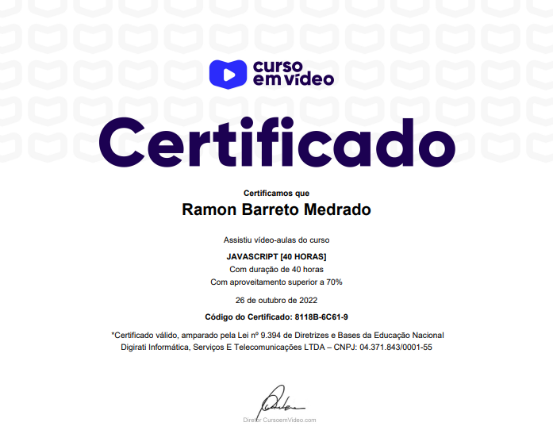

  

  

  

## Curso de JavaScript 📘
### Curso em Vídeo ▶

  

- [x] Estudo sobre os fundamentos do JavaScript e exercícios fundamentais para o aprendizado
- [x] Conhecimentos sobre as estruturas dos códigos nessa linguagem de programação, conseguindo assim ter uma boa base para adquirir maiores conhecimentos, foi um grande início realizar esse curso do Professor <a target="_blank" href="https://www.linkedin.com/in/guanabara/">Gustavo Guanabara</a>.

## Meu Certificado 📃🎉

  

## Tecnologias 🛠

- JavaScript

## Instrutor 👨🏽‍🏫
- <a target="_blank" href="https://www.linkedin.com/in/guanabara/">Gustavo Guanabara</a>

## Aluno 👨🏽‍🎓

- <a target="_blank" href="https://www.linkedin.com/in/ramon-barreto-076191180/">Ramon Barreto</a>

## Contato 📲

- Email: ramon_barreto_medrado@hotmail.com

