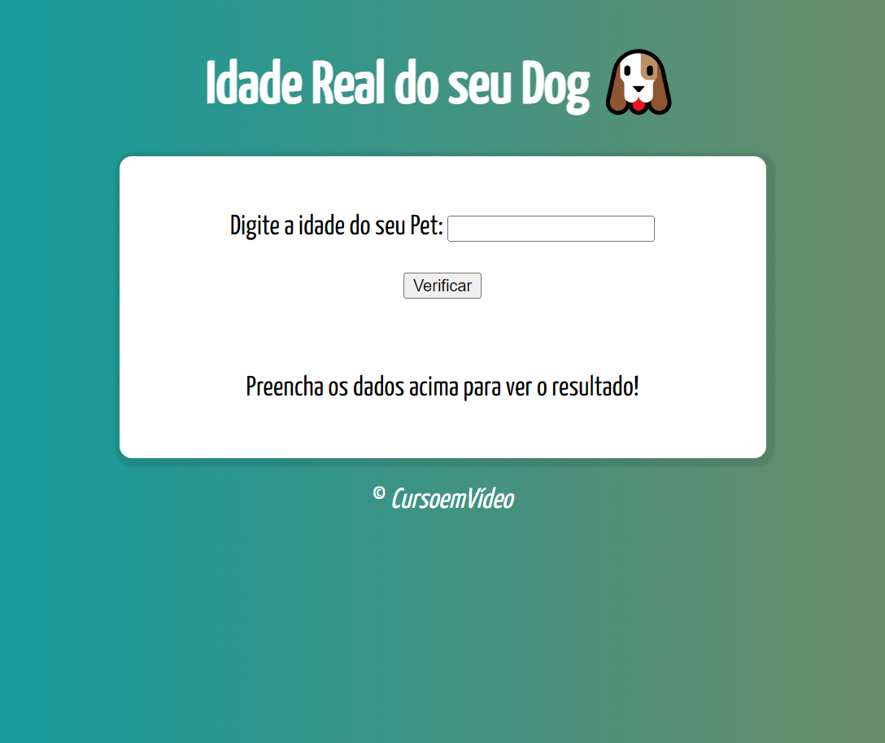

# Curso de JavaScript

>Programa para verificar a idade do seu pet.

Projeto desevolvido através dos conhenhecimentos obtidos no cursos lecionados pelo professor Gustavo Guanabara, Curso em Vídeo.

[🔗 Clique aqui para acessar](https://ramonbarret.github.io/dog_age/)

## 🛠 Tecnologias

- HTML5
- CSS3
- JavaScript
- Git e Github

## 📲 Contato

Email: ramon_barreto_medrado@hotmail.com